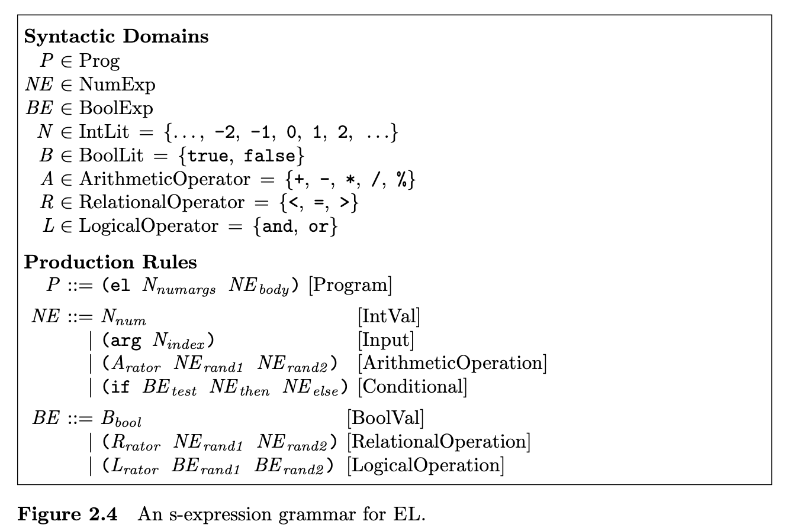

This project implements mini-languages mentioned in the book *Design Concepts in Programming Languages* using Scala3 and mill.

## PostFix: A simple stack language
The basic syntactic unit of a PostFix program is the *command*. Commands are of the following form:
- Any integer numeral
- Special command tokens: add, div, eq, exec, gt, lt, mul, nget, pop, rem, sel, sub, swap
- An executable sequence: a single command that serves as a subroutine. Written as a parenthesized list of subcommands separated by whitespaces

A PostFix *program* is a parenthesized sequence consisting of 
- The token postfix
- a natural number indicating the number of program parameters
- one or more commands

The semantics of a PostFix program is determined by executing its commands in left-to-right order. Each command manipulates an implicit stack of values that initially contains arguments, which are integer numeral. The first argument is at the top of the stack. A program signals an error if 
- Final stack is empty
- Value at the top of the final stack is not an integer
- An inapproriate stack of values is encountered or insufficient number of arguments
- The number of program parameter is inconsistent with the number of arguments


Every PostFix program is guaranteed to terminate. Thus it is not universal. To run test: `mill postfix.test`. 

## S-Expression
A symbolic expression is a notation for representing trees by paranthesized linear text strings. A symbolic token is (approximation) any sequence of characters that does not contain a left or right parenthesis or whitesapce. An intermediate node is a pair of parenthesis surrounding the s-expression that represents the subtree.

A *syntactic domain* is a collection of program phrases. Primitive syntactic domains are collections of phrases with no substructure. A *production rule* specifies the structure of compound syntactic domains.
- Structure of S-Expression grammar
  - A list of syntactic domain, one for each kind of phrase (in EL mini-lang).
  - A set of production rules that define the structure of compound phrases

A *production rule* has following form. Each line of the rule is a *production*. *domain-variable* is the domain variable for the compound syntactic domain being defined. *pattern* is an s-expression pattern. *phrase-type* is a mnemonic name for the subclass of phrases in the domain that match the pattern. The phrase types correcpond to the labels of intermediate nodes of an AST.
```
domain-variable ::= pattern [phrase-type]
                | pattern [phrase-type]
                ...
                | pattern [phrase-type]
```
For test, `mill sexp.test`

As an example, see `EL/` for describing the syntax of EL language using S-expression. `mill el.test`

